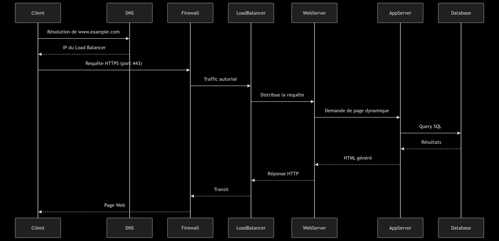

# What happens when you type https://www.google.com in your browser and press Enter

## Description

This project aims to explain what happens under the hood when you type `https://www.google.com` into your browser and press Enter. It explores the different layers of the web stack — from DNS resolution to database interactions — providing both a high-level overview and technical insight into the process.

## 📌 Blog Post

Read the full blog post here: [My blog on LinkedIn](https://www.linkedin.com/pulse/what-happens-when-you-type-httpswwwgooglecom-your-martins-de-castro-urqxf)  

## 🧠 Topics Covered

The blog post covers the following essential components of the request flow:

- **DNS Request**: How the domain name is translated into an IP address.
- **TCP/IP**: Establishing a reliable connection using the TCP protocol.
- **Firewall**: How firewalls inspect and filter incoming and outgoing traffic.
- **HTTPS/SSL**: Encryption using SSL/TLS to secure the communication.
- **Load Balancer**: Distribution of incoming requests across multiple servers.
- **Web Server**: Serving static and dynamic content (e.g., Nginx, Apache).
- **Application Server**: Running server-side logic (e.g., Node.js, Django).
- **Database**: Storage and retrieval of persistent data (e.g., MySQL, PostgreSQL).

## 🖼️ Diagram Overview

The diagram shows:

- DNS resolution process
- The encrypted HTTPS request
- Firewall checks
- Load balancing
- Web server handling
- Application server logic
- Database interaction

You can view the diagram here:

## 📖 License

This project is part of the curriculum at **Holberton School**.
